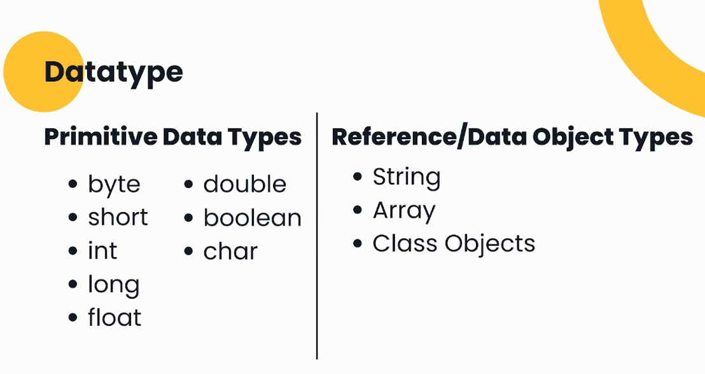
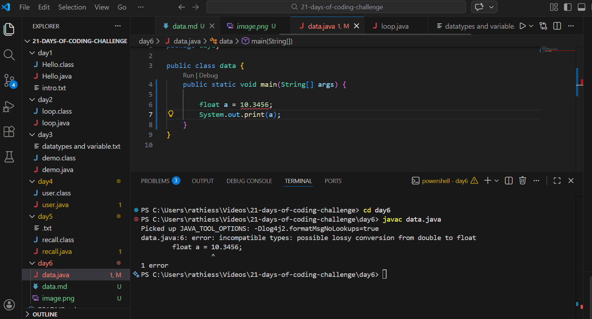
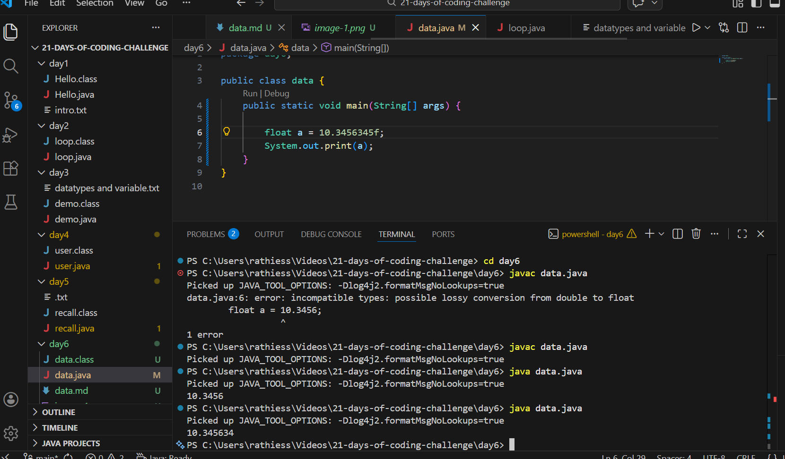

in dataypes actually two types:

* primitive datatype and data object type,

firstly will see primitive datatype:

in this the int datatype took 4 bytes,
long took up 8 bytes
 
  then comes to float :
   after decimal maximum 6 numbers we can give
   

   it shows error why because even if i declare float means it wil only take it as long , in java defaultly taken as long that's why its shown an error, 
   if i want to mention the float means after the number i would add "f"
   after it does not shows any error 
    in this image i add after the decimal 7 number but it does not show error instead i convert as whole number 

   next char and string data type :

   generally char stores 1 value.
   
   string stores multiple char values 
   thats why its called an "object"  the important thing is in string only the 'S' is capital.